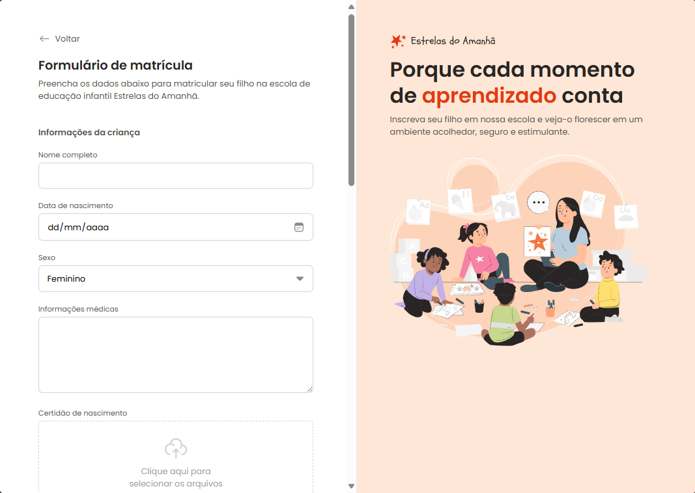

# Projeto - Formulário de Matrícula

🚀 Um repositório destinado para o projeto Formulário de Matrícula da jornada do curso **Full-Stack** da Rocketseat, ministrado pelo Mayk Brito. ⚒

> Formação Full-Stack: [Nível 4] Avançando no HTML e CSS

O projeto desenvolvido, foi pensado na exploração de criação de formulários em HTML, abordando campos de entrada de texto, data, seleção, text area e envio de arquivos, com grande foco em customizar inputs desafiadores como radio e checkbox, prezando a organização de arquivos e ajustes no layout do projeto.

[🔗 Veja o projeto](fesette.github.io/Formulario-matricula/)

## 🛠️ Tecnologias

- HTML
- CSS
- Git e Github